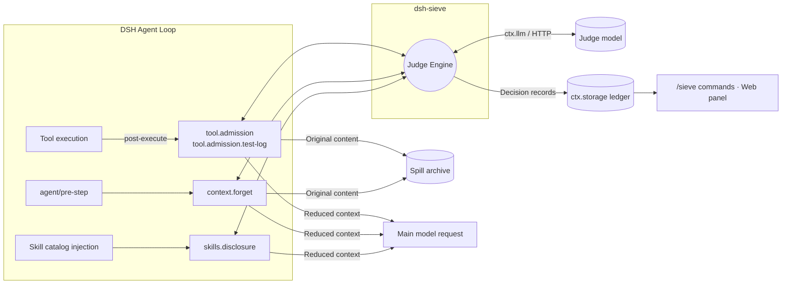

<div align="center">

[中文](README.md) | **English**


# sieve / dsh-sieve

**Context management and token optimization plugins for DeepSeek Harness (DSH)**

**Over 30% less request payload in offline replay, measured in characters**: a **36.28%** aggregate reduction across 100 public agent trajectories. See the [measurement methodology and limitations](#offline-replay-results).

sieve evaluates tool results, historical context, and skill catalogs before they enter the main model's request.
It admits the portions useful for the current task and archives the original content for retrieval at any time.

Context management for LLM agents: tool output filtering, historical context pruning, and progressive skill disclosure reduce repeated reads of irrelevant content by the main model.

[](LICENSE)
[](tsconfig.base.json)
[](package.json)
[](packages/dsh-sieve/package.json)
[](packages/dsh-sieve/package.json)
<br>


[](#design-constraints)
[](#design-constraints)

</div>

---

## Why sieve

At every step of an agent loop, the main model receives the full context again. User input is often not what drives request size:

- **Tool output**: build logs, test reports, and command output can contain thousands or tens of thousands of characters, while only a small portion matters for the next decision.
- **Stale context**: tool results superseded by later reads, or no longer relevant, are still sent with every request.
- **Skill catalogs**: descriptions of dozens or hundreds of skills are injected at the start of a session, although most are unrelated to the task.

This content is billed as input tokens, takes up the context window, and can dilute model attention. sieve inserts a **judge engine** through DSH's public extension points to control admission, forgetting, and progressive disclosure, giving the main model shorter, more focused context at each step.

## Architecture



| Component | Purpose |
|---|---|
| **Judge engine** | A shared decision engine that assembles prompts, calls the judge, validates structured output, and applies decisions only when confidence and budget thresholds are met. Judge timeouts or failures always fall back to leaving content unchanged. |
| **`tool.admission`** | Controls admission before tool results are written to the session. Handles long output in tiers, rewriting only `content` while preserving the tool call structure. |
| **`tool.admission.test-log`** | A dedicated admission path for test output that protects failures, summaries, and unrecognized content. |
| **`context.forget`** | Forgets historical tool results in batches through native DSH `compaction/prune` and result replacement. Accounts for prompt cache prefix costs and commits only after enough benefit has accumulated. |
| **`skills.disclosure`** | Filters the initial skill catalog by task relevance and discloses relevant skills in later rounds as needed. Hidden skills can still be loaded directly. |
| **Ledger** | One `ctx.storage` document per session, recording each decision's mode, result, usage, and estimated net savings. |
| **`dsh-sieve-web`** | A panel in the DSH Web right sidebar showing estimated input token reduction, its percentage, and context reduction in characters for the current session. It also configures the API key for the Jev judge service. |

## Three operating modes

All four decisions default to `active`, so context pruning starts once installed. `off` and `shadow` are available through profile configuration and `/sieve mode` for measurement and comparison; the Web panel does not provide mode switching.

| Mode | Behavior | Use case |
|---|---|---|
| `active` (default) | Runs the judge within a time limit and rewrites context when thresholds are met. | Normal use. |
| `shadow` | Runs the judge in the background and records decisions, **without changing what the model sees**. | Measurement and comparison using estimated benefits in the ledger. |
| `off` | Does not judge or rewrite content. | Baseline measurements or disabling a decision. |

`active` has an explicit waiting limit and passes through the original content on timeout. `shadow` does not block the agent loop.

## Design constraints

sieve aims to reduce context **without lowering task success rates**. This goal motivates several correctness constraints:

- **Original content is preserved**: before any lossy rewrite, the original content is written to the spill archive so the model can retrieve it as needed.
- **Cold restore consistency**: all model-visible content can be reconstructed from session logs. Requests after restore or fork match live requests, without duplicate judgments or rewrites.
- **No custom events**: state is derived solely from native DSH events, and the ledger is stored in `ctx.storage`, avoiding unknown events that would prevent session restore.
- **Zero DSH core patches**: only public extension points are used: `agent/pre-step`, tool post-execute, skill catalog listeners, `ctx.llm`, `ctx.storage`, and `connection.fetch` routes.
- **Resources follow the plugin lifecycle**: all listeners and timers are registered through `ctx`, and operations respond to `AbortSignal`, allowing full cleanup on unload or hot reload.
- **Failures preserve content**: if the judge is unavailable, its output is invalid, or the budget is exceeded, the original content is retained.

Each constraint has contract tests against the pinned DSH source version, covering call order, result replacement, spill ordering, skill catalog filtering, and cold restore behavior.

## Offline replay results

The data comes from frozen public agent trajectories and original sessions. Each trajectory was replayed and paired with all four decisions set to `off` and then `active`. Replays ran on the real DSH Loop and sieve listeners, with a live judge model (`jev-1.13.0`) and replayed main model calls.

| Dataset | Pairs | Cumulative request payload | Tool output |
|---|---:|---:|---:|
| SWE-smith + Nebius public trajectories | 100 | 537,410,284 → 342,420,598 characters (**−36.28%**) | 11,312,658 → 4,193,084 characters (**−62.93%**) |
| Of which: SWE-smith | 50 | **−30.88%** | **−50.47%** |
| Of which: Nebius | 50 | **−37.58%** | **−67.66%** |
| SWE-chat original sessions | 7 | 33,733,731 → 18,204,646 characters (**−46.03%**) | 314,263 → 128,407 characters (**−59.14%**) |

**Prompt caching.** Rewriting history can invalidate cached prefixes. Cache hits were therefore estimated from the longest common prefix of adjacent requests, then used to calculate a cost proxy. Assuming cached input costs 0.1 / 0.25 times uncached input, the cost proxy decreased by **19.94% / 29.82%** for the 100 public trajectories and **34.02% / 41.56%** for SWE-chat.

**Information retention.** Across 38 manually annotated tool output samples (29 for tuning, 9 held out), required information was retained at **72/72 and 19/19**, with no annotated required items removed.

**Correctness.** All 222 replays passed checks for tool return values and error states, protected log lines, original content archiving, native cold restore, and projection reconstruction. All 1,422 archived originals were retrievable byte for byte.

**Judge overhead.** All 326 judge requests succeeded with no fallbacks: 729,167 input tokens, 30,868 output tokens, and a total cost of approximately $0.031. HTTP latency was **287 ms** at P50, **590 ms** at P95, and 1,195 ms maximum, with no requests exceeding 4 seconds. Replay used a longer waiting limit; the production default 4-second deadline was not retested in this run.

> [!NOTE]
> Payload and tool output are measured in request JSON characters. The metrics overlap and cannot be added together; they do not equal actual token usage or billing. Cache results are estimates, not measured cache hits. Offline replay fixes subsequent actions, so it cannot establish unchanged retrieval counts or task success rates during live execution. SWE-chat replay covered only the initial skill catalog, not disclosure across multiple rounds. Comparative experiments with a live main model for task success and token usage have not yet been performed.

## Installation

| Package | Purpose | Profiles |
|---|---|---|
| `dsh-sieve` | Core plugin: judge engine, four decisions, ledger, and `/sieve` commands. | Any, including `web` and `headless`. |
| `dsh-sieve-web` | Web right sidebar panel; requires the same version of `dsh-sieve`. | `web` only. |

**Version compatibility**: sieve declares the exact DSH version in its peer dependencies. The host checks compatibility during installation and startup and refuses to load incompatible versions.

| sieve | DeepSeek Harness | Node.js |
|---|---|---|
| `0.1.0` | `0.2.1-alpha.1` | `^22.19.0 \|\| >=24.0.0` |

### Option 1: npm (recommended)

Packages are prebuilt: no local compilation or build script approval is needed. Install the core plugin and Web panel together:

```bash
dsh plugin --profile web add dsh-sieve@0.1.0 dsh-sieve-web@0.1.0
```

For profiles without a Web interface, such as `headless`, install only the core plugin:

```bash
dsh plugin --profile headless add dsh-sieve@0.1.0
```

You can also open **Plugins → Add Plugin** in the DSH Web sidebar and install `dsh-sieve@0.1.0` and `dsh-sieve-web@0.1.0` in turn. This is equivalent to using the command line.

### Option 2: GitHub Release

If npm is unavailable or you want to pin a build artifact, install the tgz files attached to the [Release](https://github.com/Sev7eEn7/sieve/releases). These are also prebuilt and do not require build script approval. The release includes `SHA256SUMS` for verification:

```bash
dsh plugin --profile web add https://github.com/Sev7eEn7/sieve/releases/download/v0.1.0/dsh-sieve-0.1.0.tgz https://github.com/Sev7eEn7/sieve/releases/download/v0.1.0/dsh-sieve-web-0.1.0.tgz
```

### Option 3: Build from source

```bash
git clone https://github.com/Sev7eEn7/sieve.git && cd sieve
```

```bash
pnpm install && pnpm release:pack
```

```bash
dsh plugin --profile web add ./release/dsh-sieve-0.1.0.tgz ./release/dsh-sieve-web-0.1.0.tgz
```

`pnpm release:pack` builds both packages, checks that versions and peers match and that artifacts contain no `workspace:` references or local paths, then writes tgz files and `SHA256SUMS` to `release/`.

> [!NOTE]
> Git installation using `github:Sev7eEn7/sieve` is not supported. This is a monorepo, and a git installation retrieves source code without the compiled `lib/` artifacts. Use one of the three options above.

### Enable and verify

1. Restart `dsh web` (required when upgrading an installed version), then refresh the browser page to reload the panel's frontend code.
2. Confirm the plugins are loaded:

   ```bash
   dsh --profile web --dump-config
   ```

   The output should contain both `# == dsh-sieve` and `# == dsh-sieve-web` layers.
3. Enter `/sieve status` in a session to view decision modes and the ledger. A **Sieve** tab will appear in the Web right sidebar.

### Upgrade and uninstall

To upgrade, run `add` with the new version number and then restart:

```bash
dsh plugin --profile web add dsh-sieve@<version> dsh-sieve-web@<version>
```

To uninstall, remove the panel first, then the core plugin, including their configuration layers:

```bash
dsh plugin --profile web remove dsh-sieve-web dsh-sieve
```

## Configuration

No configuration is required: the judge defaults to `auto`, and all decisions default to `active`. To customize behavior, configure the `sieve` service in a profile patch:

```yaml
- id: sieve
  config:
    judge:
      type: auto           # auto | llm | system-one | off
      timeoutMs: 4000
    modes:
      default: active
      skills.disclosure: shadow
    routes:                # Optional: route a decision to a cheaper llm judge model (auto and llm)
      context.forget:
        provider: <provider>
        model: <model>
```

| Judge type | Behavior |
|---|---|
| `auto` (default) | Uses Jev (System One) if a Jev key is available in DSH credentials; otherwise behaves like `llm`. Credentials are resolved for each decision, so saving or removing a key in the panel takes effect immediately. |
| `llm` | Calls DSH `ctx.llm`, reusing session routing or specifying a provider/model per decision. |
| `system-one` | External HTTP judge requiring `apiKey`; referencing an environment variable via `!!js process.env.XXX` is recommended. |
| `off` | Does not call the judge; each decision uses its fallback behavior. |

Jev keys are looked up through DSH credential references: `TYPESAFE_API_KEY` (TypeSafe) first, then `SIEVE_JUDGE_OPENROUTER_API_KEY` (OpenRouter). You can enter a key in the Web panel (stored in `$DSH_HOME/.credentials.yaml`), or provide it through process environment variables, workspace `.env`, or `$DSH_HOME/.env`. Precedence follows DSH credential store rules. A workspace `.env` containing `TYPESAFE_API_KEY` also switches the judge to Jev and incurs TypeSafe charges.

Invalid configuration, such as an unknown decision ID, fails during loading rather than silently falling back.

## Session commands

```text
/sieve status                                   Show decision modes, record counts, applied counts, and estimated net savings
/sieve mode <decision-id> <off|shadow|active|reset>  Override a decision mode for this session
/sieve route <decision-id> <provider> <model>        Override a decision's judge route for this session
/sieve route <decision-id> reset                     Restore the route from the profile
```

Commands do not call a model. Overrides apply only to the current session and the current plugin load.

## Development

```bash
pnpm install
```

```bash
pnpm build
```

```bash
pnpm release:pack
```

- `pnpm build` compiles both packages and bundles the Web panel's browser code into a single file loadable by DSH Web.
- `pnpm release:pack` builds and packages installable tgz files and `SHA256SUMS`; see [installation](#option-3-build-from-source).
- Dependencies are pinned to exact versions. `@deepseek-ai/dsh-*` packages declare exact peer versions, which the host checks during installation and startup.

```
packages/
├── dsh-sieve/          # Core plugin: judge engine, four decisions, ledger, /sieve commands
│   ├── src/judge/      # Decision engine, providers, prompts and policy, redaction
│   ├── src/features/   # Wiring between decisions and DSH extension points
│   └── src/runtime/    # Configuration, session state derivation, ledger, status snapshots
└── dsh-sieve-web/      # DSH Web panel (Host routes + browser code)
```

## Acknowledgments and license

Parts of the judge engine originate from mu. Source paths and commits are recorded in [THIRD_PARTY_NOTICES.md](packages/dsh-sieve/THIRD_PARTY_NOTICES.md).

This project is licensed under [MIT](LICENSE).
