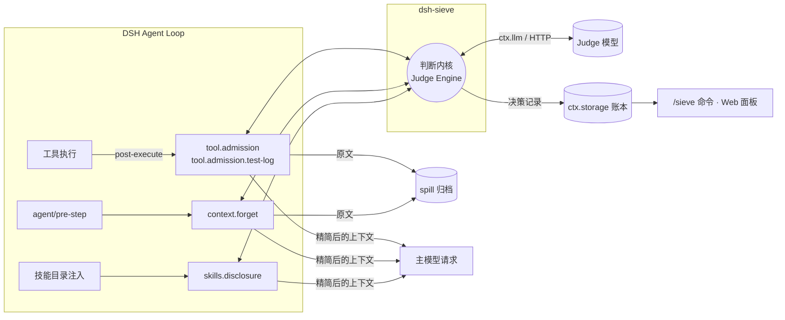

<div align="center">

**中文** | [English](README.en.md)


# sieve / dsh-sieve

**DeepSeek Harness（DSH）上下文管理与 token 优化插件**

**离线回放请求载荷减少 30% 以上（按字符数）**：100 条公开 Agent 轨迹的累计降幅为 **36.28%**，详见[实验口径与限制](#离线回放结果)。

在工具结果、历史上下文和技能目录进入主模型请求之前做判断，
只放行对当前任务有用的部分，原文全部归档、随时可取回。

为 LLM Agent 提供上下文管理（Context Management）：工具输出过滤（Tool Output Filtering）、历史上下文裁剪与技能按需披露（Progressive Skill Disclosure），减少主模型反复读取无关内容。

[](LICENSE)
[](tsconfig.base.json)
[](package.json)
[](packages/dsh-sieve/package.json)
[](packages/dsh-sieve/package.json)
<br>


[](#设计约束)
[](#设计约束)

</div>

---

## 为什么需要它

Agent 循环里，主模型每一步都要重新读一遍完整上下文。真正决定请求体大小的往往不是用户输入，而是：

- **工具输出**：构建日志、测试报告、命令输出，动辄数千到数万字符，对下一步决策有用的通常只是其中一小段；
- **陈旧上下文**：已经被后续读取覆盖、或早已不再相关的工具结果，仍然每一步都被重新发送；
- **技能目录**：几十上百个技能描述在会话开始时整体注入，大多数与当前任务无关。

这些内容按输入 token 计费，占用上下文窗口，还会稀释模型注意力。sieve 在 DSH 的公开扩展点上插入一层**判断内核**，对上面三类内容做准入、遗忘和按需披露，让主模型每一步看到的上下文更短、更集中。

## 架构



| 组件 | 作用 |
|---|---|
| **判断内核** | 统一的决策引擎：组装题面、调用 judge、校验结构化输出、按置信度与预算门槛决定是否应用；judge 超时或失败时一律回退为不改写 |
| **`tool.admission`** | 工具结果写入会话前的准入控制，对长输出做分级处理，只改写 `content`，不改工具调用结构 |
| **`tool.admission.test-log`** | 针对测试运行输出的专用准入通道，保护失败、摘要与无法识别的内容 |
| **`context.forget`** | 对历史工具结果做批量遗忘，通过 DSH 原生 `compaction/prune` 与结果替换落地，考虑提示缓存前缀成本，攒够收益才提交 |
| **`skills.disclosure`** | 首份技能目录按任务相关性过滤，相关技能在后续回合按需公布；被隐藏的技能仍可直接加载 |
| **账本** | 每个会话一份 `ctx.storage` 文档，记录每次判断的模式、结果、usage 与预计净节省 |
| **`dsh-sieve-web`** | DSH Web 右侧边栏面板：显示本会话的输入 token 缩减（估算，含缩减率）与上下文缩减字符数，配置 Jev 判断服务的 API 密钥 |

## 三种运行模式

默认四个决策都是 `active`，装上即裁剪上下文。`off` 与 `shadow` 只保留给 profile 配置与 `/sieve mode` 命令，用于测量对照；Web 面板不提供模式切换。

| 模式 | 行为 | 适用场景 |
|---|---|---|
| `active`（默认） | 限时判断，通过门槛后改写上下文 | 正常使用 |
| `shadow` | 后台判断并入账，**不改动模型看到的内容** | 测量对照：只看账本里的预计收益 |
| `off` | 不判断、不改写 | 基线或关闭某个决策 |

`active` 的判断有明确的等待上限，超时即放行原文；`shadow` 不阻塞 Agent 循环。

## 设计约束

sieve 的目标是**在不降低任务成功率的前提下**缩减上下文，因此对正确性有几条硬约束：

- **原文不丢**：任何有损改写之前，原文先写入 spill 归档，模型可以按需取回。
- **冷恢复一致**：模型可见的内容全部能从会话日志重建。在线请求与会话恢复、fork 之后的请求一致，不会重复判断或重复改写。
- **不写自定义事件**：状态只从 DSH 原生事件推导，账本放在 `ctx.storage`，不会让会话因未知事件而无法恢复。
- **DSH 核心零修改**：只使用公开扩展点（`agent/pre-step`、工具 post-execute、技能目录监听、`ctx.llm`、`ctx.storage`、`connection.fetch` 路由）。
- **资源随插件生命周期**：所有监听器与定时器通过 `ctx` 注册，处处响应 `AbortSignal`，卸载与热重载可完整清理。
- **失败即放行**：judge 不可用、输出不合法或超出预算，一律保留原文。

每条约束都有对应的契约测试，针对固定版本的 DSH 源码验证调用顺序、结果替换、spill 顺序、技能目录过滤与冷恢复行为。

## 离线回放结果

数据来自冻结的公开 Agent 轨迹与原始会话：同一批轨迹分别在四个决策全部 `off` 与全部 `active` 下回放并逐条配对，在真实 DSH Loop 与 sieve 监听器上运行，judge 使用真实模型（`jev-1.13.0`），主模型调用为回放。

| 数据集 | 配对数 | 累计请求载荷 | 工具输出 |
|---|---:|---:|---:|
| SWE-smith + Nebius 公开轨迹 | 100 | 537,410,284 → 342,420,598 字符（**−36.28%**） | 11,312,658 → 4,193,084 字符（**−62.93%**） |
| 　其中 SWE-smith | 50 | **−30.88%** | **−50.47%** |
| 　其中 Nebius | 50 | **−37.58%** | **−67.66%** |
| SWE-chat 原始会话 | 7 | 33,733,731 → 18,204,646 字符（**−46.03%**） | 314,263 → 128,407 字符（**−59.14%**） |

**提示缓存。** 改写历史会破坏缓存前缀，因此按相邻请求的最长相同前缀估算缓存命中，再算费用代理。假设命中价为未命中价的 0.1 / 0.25 时，100 条公开轨迹的费用代理分别少 **19.94% / 29.82%**，SWE-chat 少 **34.02% / 41.56%**。

**信息保留。** 在 38 个人工标注的工具输出样本上（29 条调优、9 条留出），必需信息保留 **72/72、19/19，零标注误删**。

**正确性。** 222 次回放全部通过工具返回值与错误状态、受保护日志行、原文归档、原生冷恢复和 projection 重建检查；1,422 份归档原文逐字节可取回。

**judge 开销。** 共 326 次 judge 请求，全部成功、零回退；输入 729,167 token、输出 30,868 token，总费用约 $0.031。HTTP 延迟 P50 **287 ms**、P95 **590 ms**、最大 1,195 ms，0 次超过 4 秒（回放使用更长的等待，生产默认的 4 秒截止未在本轮复跑）。

> [!NOTE]
> 载荷与工具输出按请求 JSON 的字符数计，两种口径有重叠，不能相加，也不等于实际 token 或账单；缓存一项是模型估算，不是实际命中数据。离线回放固定了后续动作，不能说明真实执行下的补读次数与任务成功率不变。SWE-chat 回放只覆盖首份技能目录，没有覆盖多轮再披露。带真实主模型的成功率与 token 对照实验尚未进行。

## 安装

| 包 | 作用 | 适用 profile |
|---|---|---|
| `dsh-sieve` | 插件本体：判断内核、四个决策、账本、`/sieve` 命令 | 任意（`web`、`headless` 等） |
| `dsh-sieve-web` | Web 右侧边栏面板，依赖同版本的 `dsh-sieve` | 仅 `web` |

**版本对应**：sieve 按 DSH 精确版本声明 peer，宿主在安装和启动时校验，版本不符会拒绝加载。

| sieve | DeepSeek Harness | Node.js |
|---|---|---|
| `0.1.0` | `0.2.1-alpha.1` | `^22.19.0 \|\| >=24.0.0` |

### 方式一：npm（推荐）

预构建包，不需要在本机编译，也不需要授权构建脚本。插件本体与 Web 面板一起装：

```bash
dsh plugin --profile web add dsh-sieve@0.1.0 dsh-sieve-web@0.1.0
```

`headless` 等没有 Web 界面的 profile 只装本体：

```bash
dsh plugin --profile headless add dsh-sieve@0.1.0
```

也可以在 DSH Web 侧边栏打开**插件 → 添加插件**，依次输入 `dsh-sieve@0.1.0`、`dsh-sieve-web@0.1.0` 安装，效果与命令行相同。

### 方式二：GitHub Release

npm 不可达或想锁定到构建产物时，直接装 [Release](https://github.com/Sev7eEn7/sieve/releases) 附带的 tgz，同样是预构建包、无需授权构建脚本。发布页附有 `SHA256SUMS` 供校验：

```bash
dsh plugin --profile web add https://github.com/Sev7eEn7/sieve/releases/download/v0.1.0/dsh-sieve-0.1.0.tgz https://github.com/Sev7eEn7/sieve/releases/download/v0.1.0/dsh-sieve-web-0.1.0.tgz
```

### 方式三：从源码构建

```bash
git clone https://github.com/Sev7eEn7/sieve.git && cd sieve
```

```bash
pnpm install && pnpm release:pack
```

```bash
dsh plugin --profile web add ./release/dsh-sieve-0.1.0.tgz ./release/dsh-sieve-web-0.1.0.tgz
```

`pnpm release:pack` 会构建两个包，检查版本与 peer 一致、产物里没有 `workspace:` 和本机路径，然后把 tgz 和 `SHA256SUMS` 输出到 `release/`。

> [!NOTE]
> 不支持 `github:Sev7eEn7/sieve` 这种 git 安装：仓库是 monorepo，git 安装只拿到源码，不带 `lib/` 构建产物。请用上面三种方式之一。

### 启用与验证

1. 重启 `dsh web`（升级已装版本时必须重启），然后刷新浏览器页面，让面板的前端代码重新加载。
2. 确认已加载：

   ```bash
   dsh --profile web --dump-config
   ```

   输出里应有 `# == dsh-sieve` 和 `# == dsh-sieve-web` 两层。
3. 在会话中输入 `/sieve status`，能看到各决策的模式与账本；Web 右侧边栏会出现 **Sieve** 页。

### 升级与卸载

升级时用新版本号重新 `add`，之后重启：

```bash
dsh plugin --profile web add dsh-sieve@<版本> dsh-sieve-web@<版本>
```

卸载时连同配置层一起移除，先卸面板，再卸本体：

```bash
dsh plugin --profile web remove dsh-sieve-web dsh-sieve
```

## 配置

不写配置即可使用：judge 为 `auto`，所有决策为 `active`。需要调整时在 profile 的 patch 中配置 `sieve` 服务：

```yaml
- id: sieve
  config:
    judge:
      type: auto           # auto | llm | system-one | off
      timeoutMs: 4000
    modes:
      default: active
      skills.disclosure: shadow
    routes:                # 可选：为单个决策指定更便宜的 llm judge 模型（auto 与 llm）
      context.forget:
        provider: <provider>
        model: <model>
```

| judge 类型 | 说明 |
|---|---|
| `auto`（默认） | DSH 凭据存储里有 Jev 密钥时用 Jev（System One），否则同 `llm`；每次判断时解析密钥，面板保存或移除后立即生效 |
| `llm` | 通过 DSH `ctx.llm` 调用，可复用会话路由或按决策单独指定 provider/model |
| `system-one` | 外部 HTTP judge，需要 `apiKey`（建议用 `!!js process.env.XXX` 引用环境变量） |
| `off` | 不调用 judge，各决策取其回退行为 |

Jev 密钥按 DSH 凭据引用查找，先 `TYPESAFE_API_KEY`（TypeSafe），再 `SIEVE_JUDGE_OPENROUTER_API_KEY`（OpenRouter）。可在 Web 面板填写（存入 `$DSH_HOME/.credentials.yaml`），也可来自进程环境变量、工作区 `.env` 或 `$DSH_HOME/.env`，优先级按 DSH 凭据存储的规则。注意：工作区 `.env` 里的 `TYPESAFE_API_KEY` 也会让 judge 改用 Jev，产生 TypeSafe 计费。

非法配置（例如未知的决策 id）在加载时直接报错，不会静默回退。

## 会话命令

```text
/sieve status                                   查看本会话各决策的模式、记录数、已应用数与预计净节省
/sieve mode <决策 id> <off|shadow|active|reset>  覆盖本会话某个决策的模式
/sieve route <决策 id> <provider> <model>        覆盖本会话某个决策的 judge 路由
/sieve route <决策 id> reset                     恢复 profile 中的路由
```

命令不调用模型，覆盖只在当前会话、本次插件装载期间有效。

## 开发

```bash
pnpm install
```

```bash
pnpm build
```

```bash
pnpm release:pack
```

- `pnpm build` 编译两个包，并把 Web 面板的浏览器端打成 DSH Web 可加载的单文件。
- `pnpm release:pack` 构建并打包出可安装的 tgz 与 `SHA256SUMS`，见[安装](#方式三从源码构建)。
- 依赖全部锁定精确版本；`@deepseek-ai/dsh-*` 以精确版本声明为 peer，宿主在安装与启动时校验。

```
packages/
├── dsh-sieve/          # 插件本体：判断内核、四个决策、账本、/sieve 命令
│   ├── src/judge/      # 决策引擎、providers、题面与 policy、脱敏
│   ├── src/features/   # 各决策点与 DSH 扩展点的接线
│   └── src/runtime/    # 配置、会话状态推导、账本、状态快照
└── dsh-sieve-web/      # DSH Web 面板（Host 路由 + 浏览器端）
```

## 致谢与许可

部分判断内核代码源自 mu，来源路径与 commit 记录在 [THIRD_PARTY_NOTICES.md](packages/dsh-sieve/THIRD_PARTY_NOTICES.md)。

本项目以 [MIT](LICENSE) 许可发布。
