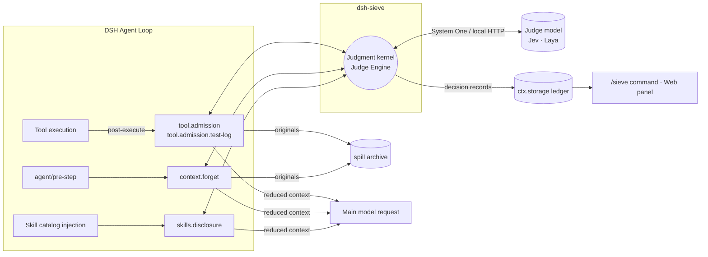
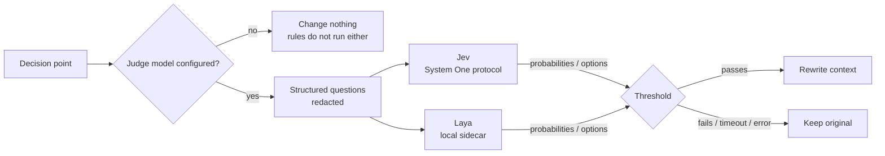

<div align="center">

**English** | [简体中文](README.zh-CN.md)


# sieve / dsh-sieve

**LLM agent context engineering and token efficiency plugins for DeepSeek Harness (DSH)**

sieve filters tool output, prunes older context and progressively discloses skills to reduce redundant input tokens in AI coding agents, improve context window utilization and provide observable usage data for LLM inference cost optimization. Originals are archived before rewriting and can be retrieved on demand.

**Over 30% less request payload in offline replay, measured in characters**: a **36.28%** aggregate reduction across 100 public agent trajectories. See [offline replay results](#offline-replay-results).

**Historical live model results: 21.2% lower main model input token usage** across 80 paired runs on deepseek-flash, with cache hit rate moving from 93.4% to 92.9%. This experiment used the now-removed session-model judge path; the current Jev / Laya configuration has not been remeasured. See [live model results](#live-model-results-deepseek-flash) and the [cache FAQ](#faq).

Built around context engineering and token efficiency, sieve manages the context delivered to the model within the agent loop, reducing repeated input across multi-step tool use.

[](LICENSE)
[](tsconfig.base.json)
[](package.json)
[](packages/dsh-sieve/package.json)
[](packages/dsh-sieve/package.json)
<br>


[](#design-constraints)
[](#design-constraints)

</div>

---

> [!IMPORTANT]
> sieve works only with a judge model configured: **Jev** (hosted, needs an API key) or **Laya** (local, macOS on Apple Silicon). sieve never uses the session's model in its place. With neither configured, the plugin loads but changes no context. See [judge models](#judge-models-jev--laya).

## Why sieve

In an agent loop the main model rereads its whole context at every step. What makes requests large is rarely the user's input. It is:

- **Tool output**: build logs, test reports and command output run to thousands or tens of thousands of characters, and the next step usually needs a small part of it;
- **Stale context**: tool results that a later read superseded, or that stopped mattering long ago, are sent again at every step;
- **Skill catalogs**: dozens or hundreds of skill descriptions are injected at session start, most of them unrelated to the task.

All of this is billed as input tokens, fills the context window and dilutes the model's attention. sieve adds a **judgment kernel** on DSH's public extension points that admits, forgets and progressively discloses these three kinds of content, so the main model sees a shorter, more focused context at every step.

The hard part is deciding what can go. Fixed rules have to keep any output format they have not seen; asking the main model to decide costs its tokens and a full round of reasoning. sieve hands this step to a dedicated judge model that answers structured yes/no and single-choice questions with probabilities, and the kernel rewrites or keeps the original by threshold. In offline replay, the median latency of one Jev judgment was about 0.3 seconds.

## Core capabilities and use cases

For AI coding agents running on DeepSeek Harness, especially tasks with verbose test logs, frequent tool calls, long sessions or large skill catalogs.

| Optimization area | How sieve handles it |
|---|---|
| **Input token reduction** | Filters redundant tool content before it enters the session, reducing input resent on later steps |
| **Tool output filtering** | Handles build logs, test reports and command output by category, protecting failure details and test summaries |
| **Context compaction / pruning** | Replaces irrelevant older tool results in batches, retaining archive pointers for on-demand retrieval |
| **Progressive skill disclosure** | Shows skills by task relevance, reducing context window usage from unrelated descriptions |
| **Prompt cache awareness** | Processes new results before they are recorded and batches historical pruning to control prefix rebuild frequency |

## Quick start

1. Install the plugin (the web profile also gets the panel):

   ```bash
   dsh plugin --profile web add dsh-sieve@0.2.0 dsh-sieve-web@0.2.0
   ```

2. Configure a judge model, one of:
   - **Jev**: paste a TypeSafe or OpenRouter API key on the **Sieve** page of the DSH Web sidebar, or set the `TYPESAFE_API_KEY` environment variable;
   - **Laya**: start the Laya server on this machine and set `judge.type` to `laya` in the profile, see [Using Laya](#using-laya).
3. Restart `dsh web` and reload the page, then enter `/sieve status` in a session and check that the "判断模型" (judge model) line does not say "未配置" (not configured).

For other ways to install (GitHub Release, building from source) see [Installation](#installation).

## Architecture



| Component | Role |
|---|---|
| **Judgment kernel** | One decision engine: builds the questions, calls the judge model, validates the structured answers and decides by confidence threshold whether to rewrite; a timeout or failure always keeps the original |
| **`tool.admission`** | Admission control for tool results before they enter the session; handles long output in tiers and rewrites only `content`, never the tool call |
| **`tool.admission.test-log`** | A dedicated admission path for test runs that protects failures, summaries and anything it does not recognize |
| **`context.forget`** | Forgets older tool results in batches through DSH's native `compaction/prune` and result replacement; a batch is committed only when it saves enough, see the [cache FAQ](#faq) |
| **`skills.disclosure`** | Filters the first skill catalog by task relevance and announces skills that become relevant in later turns; hidden skills can still be loaded directly |
| **Ledger** | One `ctx.storage` document per session with each judgment's result, usage and estimated saving |
| **`dsh-sieve-web`** | DSH Web sidebar panel: the session's estimated input token reduction and context reduction in characters, the judge model in use, and Jev key configuration |

## Judge models (Jev / Laya)

What rules can handle, deterministic rules handle. What they cannot settle goes to the judge model. A decision point turns the content into structured questions (yes/no, single choice); the judge model answers each with a probability or an option, and the kernel rewrites or keeps the original by threshold.



| Judge model | Description | Needs |
|---|---|---|
| **Jev** | TypeSafe's structured judgment model. It answers yes/no and single-choice questions natively over the System One protocol, with a probability for each answer. Reached through TypeSafe's own endpoint or OpenRouter, billed by TypeSafe ([official pricing](https://docs.typesafe.ai/models)) | A TypeSafe or OpenRouter API key |
| **Laya** | An open-weight typed decision model (mmBERT-base, 322M) running on Core ML on this machine: requests never leave it and cost nothing. Its window is only 1024 tokens, so long states are cut, and it is clearly weaker than Jev on complex questions | macOS on Apple Silicon, with the local server from mu |

**No session model.** Judgments go only to Jev or Laya. sieve never hands a judgment to the session's main model and has no setting for it; a profile from an older version with `judge.type: llm`, `judge.type: off`, `judge.provider` or `routes` fails to load.

**No judge model, no changes.** The default `judge.type: auto` looks for a Jev key before each decision. Without one, all four decisions let everything through: nothing is folded, forgotten or filtered, and nothing is recorded; `/sieve status` and the web panel say no judge model is configured. A saved key takes effect from the next decision, without a restart.

**Judgments stay out of the conversation.** A judge call is a side request: it is not written to the session log, does not enter the main model's context and does not change the main model's request prefix. What goes to the judge is redacted first: only content that is certainly a credential is replaced, namely credential-shaped tokens, assignments whose names mark them as secrets, and the values of this process's credential variables.

**Failure keeps the original.** Each judgment has a deadline (4000 ms by default); on a timeout, an error or an invalid answer the original is kept and the reason is recorded in the ledger.

### Using Jev

Provide a key in any of these ways:

- **Web panel**: the "Jev 判断服务" (Jev judge service) section of the **Sieve** sidebar page. Paste a TypeSafe or OpenRouter key and save it. The key is stored in `$DSH_HOME/.credentials.yaml`, sent only to the host, and never shown again. With both configured, TypeSafe is used.
- **Environment variables**: `TYPESAFE_API_KEY` or `SIEVE_JUDGE_OPENROUTER_API_KEY`, in the shell that starts `dsh`, a `.env` in the start directory, or `$DSH_HOME/.env`. Process environment variables take precedence over keys saved in the panel; the panel then shows only the source and cannot change it.
- **Profile**: `judge.type: system-one` with an `apiKey` (preferably `!!js process.env.XXX`) and optional `baseUrl` and `model`, see [Configuration](#configuration).

> [!NOTE]
> With the default `auto`, any `TYPESAFE_API_KEY` in the environment (an export in a shell profile, or a project `.env`) makes sieve call Jev and incur TypeSafe charges.

Measured in offline replay: 326 Jev requests, all successful; HTTP latency P50 287 ms, P95 590 ms.

### Using Laya

The local Laya server comes from [mu](https://github.com/qybaihe/mu) and supports only macOS on Apple Silicon. sieve only connects to it; it does not install or start it.

```bash
npm i -g mu-agent
```

```bash
mu judge setup
```

```bash
mu judge start
```

`setup` creates the Python environment and downloads and verifies the weights (about 680 MB); `start` keeps the server running in the background on `127.0.0.1:47823`. Then set in the profile:

```yaml
- id: sieve
  config:
    judge:
      type: laya
      # baseUrl: http://127.0.0.1:47823   # the default; set it only if the sidecar uses another port
```

While the Laya server is not running, every judgment fails and keeps the original, recorded as `error:unreachable` in the ledger; the rules still run.

> [!NOTE]
> Laya's window is 1024 tokens, shared by the question, its options and the state; anything beyond is cut from the end of the state and recorded as a warning in the ledger. mu's measurements show it usable on simple predicates and close to random on questions that need a synthesized judgment. sieve's four decisions have not been measured on Laya; use Jev when judgment quality matters.

## Design constraints

sieve aims to reduce context **without lowering the task success rate**, so it holds itself to a few hard constraints:

- **Nothing is lost**: before any lossy rewrite, the original goes to the spill archive, and the model can read it back on demand.
- **Cold restore is consistent**: everything the model sees can be rebuilt from the session log. Requests after a resume or fork match the live ones, with no repeated judgments or rewrites.
- **No custom events**: state is derived from native DSH events and the ledger lives in `ctx.storage`, so an unknown event can never make a session unresumable.
- **Zero DSH core patches**: only public extension points (`agent/pre-step`, tool post-execute, the skill catalog listener, `ctx.storage`, `ctx.credentials`, `connection.fetch` routes).
- **Resources follow the plugin lifecycle**: every listener and timer is registered through `ctx` and every operation honors `AbortSignal`, so unloading and hot reload clean up completely.
- **Fail open**: when the judge model is unavailable, answers invalidly or times out, the original is kept.

Each constraint has contract tests that check call order, result replacement, spill order, skill catalog filtering and cold restore against the pinned DSH source.

## Offline replay results

The data are frozen public agent trajectories and raw sessions. Each trajectory was replayed with all four decisions off and with all four on, paired one to one, on the real DSH loop with sieve's listeners. The judge was the real Jev (`jev-1.13.0`); main model calls were replayed.

| Dataset | Pairs | Total request payload | Tool output |
|---|---:|---:|---:|
| SWE-smith + Nebius public trajectories | 100 | 537,410,284 → 342,420,598 chars (**−36.28%**) | 11,312,658 → 4,193,084 chars (**−62.93%**) |
| &nbsp;&nbsp;of which SWE-smith | 50 | **−30.88%** | **−50.47%** |
| &nbsp;&nbsp;of which Nebius | 50 | **−37.58%** | **−67.66%** |
| SWE-chat raw sessions | 7 | 33,733,731 → 18,204,646 chars (**−46.03%**) | 314,263 → 128,407 chars (**−59.14%**) |

**Information retention.** On 38 hand-labeled tool output samples (29 for tuning, 9 held out), required information was kept **72/72 and 19/19, with zero labeled deletions**.

**Correctness.** All 222 replays passed the checks on tool return values and error states, protected log lines, the original archive, native cold restore and projection rebuild; all 1,422 archived originals can be read back byte for byte.

**Judge overhead.** 326 Jev requests, all successful, no fallbacks; 729,167 input and 30,868 output tokens. HTTP latency P50 **287 ms**, P95 **590 ms**, max 1,195 ms, none over 4 seconds (the replay waited longer; the production 4-second deadline was not rerun in this round).

> [!NOTE]
> Payload and tool output are counted in characters of request JSON. The two measures overlap, cannot be added, and are not actual tokens. Offline replay fixes the follow-up actions, so it cannot show that re-reads and task success are unchanged in a live run. The SWE-chat replay covers only the first skill catalog, not later re-disclosure.

## Live model results (DeepSeek Flash)

On 2026-10-07 we ran a paired experiment with a live main model on deepseek-flash: the pinned DSH CLI (0.2.1-alpha.1) ran real headless sessions in a disposable `DSH_HOME`, and the model chose its own tool calls. 4 tasks (fix from a test log, fix from a build error, load a skill, 7 incremental edits plus a recall question) × 4 configurations × 5 repetitions; all 80 runs were valid, and the decision rules were written down before the runs.

| Configuration | Main input tokens | Cache misses | Output | Cache hit rate |
|---|---:|---:|---:|---:|
| sieve off (baseline) | 3.73M | 248K | 68K | 93.4% |
| Baseline, second run (noise reference) | +4.5% | −2.4% | −1.4% | 93.8% |
| **All four decisions on** | **−21.2%** | **−15.3%** | **−6.7%** | 92.9% |
| All on, forgetting off | −11.6% | −11.5% | −3.5% | 93.3% |

- **Tokens**: all on used about 21% fewer tokens than the baseline, beyond the noise of rerunning the same configuration (about 4%). With forgetting off the saving was about 11%, so forgetting accounts for about half.
- **Cache**: the hit rate did not change with sieve on; excluding each run's first request, it was 96.1% for the baseline and 96.3% with all on. Why forgetting rewrites history without lowering the hit rate is explained in the [FAQ](#faq).
- **Task results**: every configuration solved the code tasks 20/20. On the recall question, all on answered wrong once, because the model itself cut the line with the answer using `tail -60`; sieve had not touched that output. Every other configuration answered correctly.

> [!NOTE]
> At the time of this run sieve still allowed the session's model to judge, and there was no Jev key in the environment, so deepseek-flash judged for itself (5 of 17 calls exceeded the 4-second deadline and kept the original). The current version has removed that path and needs Jev or Laya; the table has not been rerun with Jev or Laya. Since most of the saving comes from rules, the change of judge model mainly affects what the rules cannot settle. The experiment also covers only 4 self-built tasks on deepseek-flash, task success is near the ceiling so it discriminates little, and cold restore was not tested.

## FAQ

### How does sieve improve LLM inference costs and token efficiency?

sieve reduces redundant content repeatedly sent from tool output, older results and skill catalogs, lowering main model input token usage. Context compression here means content selection, pruning and retrieval from an archive; it does not modify model weights or the tokenizer.

Lower input usage does not translate directly into the same reduction in API costs. Net cost evaluation must include cached and uncached main model input, output tokens, Jev judge fees and any additional retrieval of originals; Laya also uses local compute resources. Existing experiments report request characters and main model token usage separately and do not establish an end-to-end net cost reduction for the current version.

### Does sieve invalidate the main model's prompt cache?

Not persistently. Prompt caches match by prefix: the part of a request that is identical to the start of earlier requests is served from cache, and everything from the first differing byte on counts as a miss. So what matters is whether sieve changes content that **has already been sent**. Case by case:

| Source | Changes content already sent? | Effect on the cache |
|---|---|---|
| Judge model calls (Jev / Laya) | No: side requests to the judge service, never written to the session log or the main model's request | None |
| `tool.admission`, `tool.admission.test-log` | No: a tool result is rewritten **before it enters the session**, so only the newly appended content changes; references point back to earlier content without modifying it | None: the next request's prefix is the previous request plus the reduced new result |
| `skills.disclosure` | No: the first catalog is filtered **before it enters the session**; skills that become relevant later are announced in new messages | None |
| System prompt, tool definitions | No: sieve does not touch them | None |
| Session resume, fork | No: rewrites are in the session log, and a resumed session is rebuilt from it byte for byte, with no new judgments | None |
| `context.forget` | **Yes**: replaces large older tool results with their ends and an archive pointer | Once per batch: everything from the first replaced result on is written to the cache again in that one request |

`context.forget` is the only part that rewrites history, and it is designed to keep that rebuild an occasional one-time cost:

1. **Mostly old results**: rules forget only results before the 4 most recent (`keepRecent`) of at least 1,500 characters, plus earlier reads that a later read fully covers; newer results are replaced only when the judge model finds them no longer needed;
2. **Commit only when it pays**: a batch lands only if it saves at least 10,000 characters (`minBatchChars`); otherwise it waits for the next one, instead of changing a little at every step;
3. **One rebuild per batch**: all replacements in a batch land before the same request, and later requests hit the cache again on the new, shorter prefix, sending less at every following step.

Example: at step 30 the context holds 20 tool results. Before step 31, results 3, 5 and 8 are found forgettable, saving 24,000 characters together, above the 10,000-character threshold, so all three replacements land at once. The step 31 request differs from step 30 from result 3 on, and that part counts as a miss once; from step 32 on the prefix matches step 31 again and hits, and every step sends 24,000 characters less than without forgetting.

Measured (deepseek-flash, 80 runs): cache hit rate 93.4% for the baseline and 92.9% with all four decisions on; excluding each run's first request, 96.1% and 96.3%, within noise.

To avoid the rebuild entirely, turn off forgetting alone:

```yaml
- id: sieve
  config:
    modes:
      context.forget: off
```

The other three decisions then never change content already sent and leave the cache prefix alone; the cost is that the token reduction in the same experiment fell from about 21% to about 11%.

### Do judge model calls use the main model's context?

No. A judge request carries only the content being judged and the task goal (redacted), goes to Jev or Laya, and its probabilities are used inside sieve only. Nothing of it is written to the session, and the main model never sees it.

## Installation

| Package | Role | Profiles |
|---|---|---|
| `dsh-sieve` | The plugin: judgment kernel, four decisions, ledger, `/sieve` command | Any (`web`, `headless`, …) |
| `dsh-sieve-web` | The Web sidebar panel; needs `dsh-sieve` of the same version | `web` only |

**Version compatibility**: sieve declares its DSH peers at exact versions; the host checks them at install and startup and refuses to load on a mismatch.

| sieve | DeepSeek Harness | Node.js |
|---|---|---|
| `0.2.0` | `0.2.1-alpha.1` | `^22.19.0 \|\| >=24.0.0` |

### Option 1: npm (recommended)

Prebuilt packages: nothing compiles on your machine and no build scripts need approval. Install the plugin and the Web panel together:

```bash
dsh plugin --profile web add dsh-sieve@0.2.0 dsh-sieve-web@0.2.0
```

Profiles without a Web UI, such as `headless`, install only the plugin:

```bash
dsh plugin --profile headless add dsh-sieve@0.2.0
```

You can also open **Plugins → Add plugin** in the DSH Web sidebar and enter `dsh-sieve@0.2.0`, then `dsh-sieve-web@0.2.0`; the result is the same.

### Option 2: GitHub Release

If npm is unreachable or you want to pin the exact build, install the tarballs attached to the [Release](https://github.com/Sev7eEn7/sieve/releases). They are the same prebuilt packages. The release includes `SHA256SUMS` for verification:

```bash
dsh plugin --profile web add https://github.com/Sev7eEn7/sieve/releases/download/v0.2.0/dsh-sieve-0.2.0.tgz https://github.com/Sev7eEn7/sieve/releases/download/v0.2.0/dsh-sieve-web-0.2.0.tgz
```

### Option 3: Build from source

```bash
git clone https://github.com/Sev7eEn7/sieve.git && cd sieve
```

```bash
pnpm install && pnpm release:pack
```

```bash
dsh plugin --profile web add ./release/dsh-sieve-0.2.0.tgz ./release/dsh-sieve-web-0.2.0.tgz
```

`pnpm release:pack` builds both packages, checks that versions and peers agree and that the output contains no `workspace:` or local paths, then writes the tarballs and `SHA256SUMS` to `release/`.

> [!NOTE]
> Installing from git (`github:Sev7eEn7/sieve`) is not supported: the repository is a monorepo, and a git install gets only the sources, without the built `lib/`. Use one of the three options above.

### Enable and verify

1. Configure a judge model ([Jev](#using-jev) or [Laya](#using-laya)).
2. Restart `dsh web` (required after upgrading an installed version), then reload the browser page so the panel's frontend loads again.
3. Check that it loaded:

   ```bash
   dsh --profile web --dump-config
   ```

   The output should contain the `# == dsh-sieve` and `# == dsh-sieve-web` layers.
4. Enter `/sieve status` in a session: the "判断模型" (judge model) line should name Jev or Laya; if it says "未配置" (not configured), sieve changes nothing. A **Sieve** page appears in the Web sidebar.

### Upgrade and uninstall

To upgrade, `add` again with the new version and restart:

```bash
dsh plugin --profile web add dsh-sieve@<version> dsh-sieve-web@<version>
```

To uninstall, remove the packages together with their configuration layers, the panel first:

```bash
dsh plugin --profile web remove dsh-sieve-web dsh-sieve
```

## Configuration

With Jev you need no configuration at all: the judge is `auto` and every decision is on; put a key in the credential store or the environment. To adjust anything, configure the `sieve` service in the profile's patch:

```yaml
- id: sieve
  config:
    judge:
      type: auto           # auto | system-one | laya
      timeoutMs: 4000
    modes:
      default: active
      context.forget: off  # e.g. turn off forgetting alone
```

| `judge.type` | Description |
|---|---|
| `auto` (default) | The Jev key in the DSH credential store or the environment (`TYPESAFE_API_KEY` first, then `SIEVE_JUDGE_OPENROUTER_API_KEY`); with neither, nothing changes |
| `system-one` | The Jev endpoint named in the profile; needs `apiKey` (preferably `!!js process.env.XXX`), optional `baseUrl` and `model` (default `jev-latest`) |
| `laya` | The local Laya server; optional `baseUrl` (default `http://127.0.0.1:47823`), no key |

`modes` sets each decision to `active` (default) or `off`; `default` covers the decisions not listed. Decision ids: `tool.admission`, `tool.admission.test-log`, `context.forget`, `skills.disclosure`.

Example with an explicit Jev endpoint:

```yaml
- id: sieve
  config:
    judge:
      type: system-one
      apiKey: !!js process.env.MY_JUDGE_KEY
      baseUrl: https://<System One endpoint>
      model: jev-latest
```

An invalid configuration (an unknown decision id, say, or the removed `llm` judge settings) fails at load instead of silently falling back.

## Session commands

```text
/sieve status                             Show the judge model in use and, per decision in this session, its mode, records, applied count and estimated net saving
/sieve mode <decision id> <off|active|reset>   Override a decision's mode in this session; reset returns to the profile's setting
```

Commands never call a model, and overrides last only for the current session while the plugin stays loaded.

## Development

```bash
pnpm install
```

```bash
pnpm build
```

```bash
pnpm typecheck && pnpm test
```

- `pnpm build` compiles both packages and bundles the Web panel's browser side into a single file DSH Web can load.
- The tests need no keys: the main model is a scripted adapter, and the judge model is a stub of the Laya protocol over local loopback HTTP.
- `pnpm release:pack` builds and packs installable tarballs with `SHA256SUMS`; see [Installation](#option-3-build-from-source).
- Every dependency is pinned to an exact version; `@deepseek-ai/dsh-*` are declared as exact peers, which the host checks at install and startup.

```
packages/
├── dsh-sieve/          # The plugin: judgment kernel, four decisions, ledger, /sieve command
│   ├── src/judge/      # Decision engine, Jev and Laya providers, questions and policies, redaction
│   ├── src/features/   # Wiring of each decision point to DSH extension points
│   └── src/runtime/    # Configuration, derived session state, ledger, status snapshots
└── dsh-sieve-web/      # The DSH Web panel (host routes + browser side)
```

## Acknowledgments and license

Parts of the judgment kernel and the Laya provider come from [mu](https://github.com/qybaihe/mu); source paths and the commit are recorded in [THIRD_PARTY_NOTICES.md](packages/dsh-sieve/THIRD_PARTY_NOTICES.md).

Released under the [MIT](LICENSE) license.
