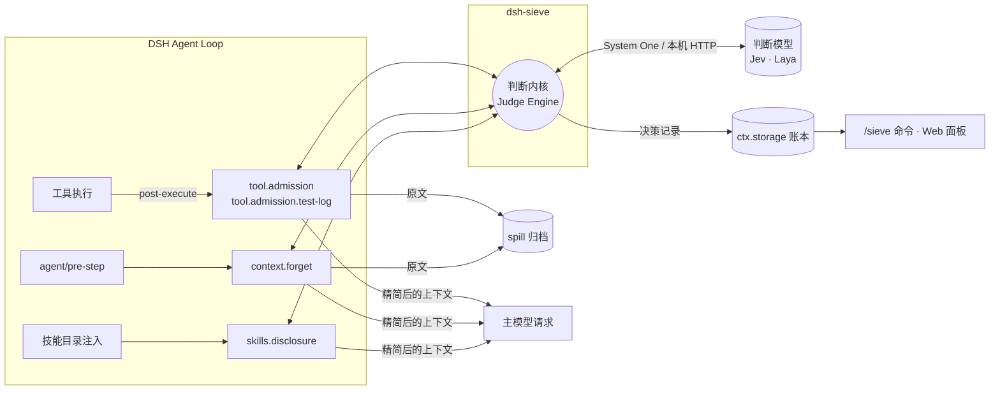
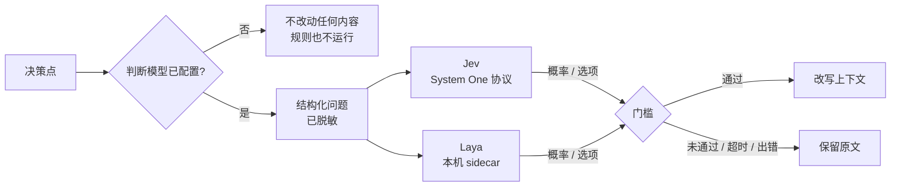

<div align="center">

[English](README.md) | **中文**


# sieve / dsh-sieve

**面向 DeepSeek Harness（DSH）的 LLM Agent 上下文工程与 Token 效率优化插件**

sieve 通过工具输出过滤、历史上下文裁剪与技能按需披露，降低 AI 编程智能体的冗余输入 token 开销，改善上下文窗口利用率，为 LLM 推理成本优化提供可观测的用量依据。改写前归档原文，支持按需取回。

**离线回放请求载荷减少 30% 以上（按字符数）**：100 条公开 Agent 轨迹的累计降幅为 **36.28%**，详见[离线回放结果](#离线回放结果)。

**历史真实模型实测：主模型输入 token 用量降低 21.2%**：deepseek-flash 上 80 次配对运行，缓存命中率为 93.4% → 92.9%。该实验使用已移除的会话模型判断路径，当前 Jev / Laya 配置尚未复测；详见[真实模型实测](#真实模型实测deepseek-flash)与[缓存问答](#常见问题)。

围绕上下文工程（Context Engineering）与 Token 效率（Token Efficiency），sieve 在 Agent 循环中管理模型实际接收的上下文，减少多轮工具调用中的重复输入。

[](LICENSE)
[](tsconfig.base.json)
[](package.json)
[](packages/dsh-sieve/package.json)
[](packages/dsh-sieve/package.json)
<br>


[](#设计约束)
[](#设计约束)

</div>

---

> [!IMPORTANT]
> sieve 必须配置一个判断模型才会工作：**Jev**（云端，需要 API 密钥）或 **Laya**（本机，macOS Apple Silicon）。sieve 不用会话模型代替判断模型。两者都没配置时，插件照常加载，但不改动任何上下文。配置方法见[判断模型](#判断模型jev--laya)。

## 为什么需要它

Agent 循环里，主模型每一步都要重新读一遍完整上下文。决定请求体大小的往往不是用户输入，而是：

- **工具输出**：构建日志、测试报告、命令输出，动辄数千到数万字符，对下一步有用的通常只是其中一小段；
- **陈旧上下文**：已经被后续读取覆盖、或早已不再相关的工具结果，每一步都被重新发送；
- **技能目录**：几十上百个技能描述在会话开始时整体注入，大多数与当前任务无关。

这些内容按输入 token 计费，占用上下文窗口，还会稀释模型的注意力。sieve 在 DSH 的公开扩展点上加一层**判断内核**，对这三类内容做准入、遗忘和按需披露，让主模型每一步看到的上下文更短、更集中。

难点在于判断哪些可以省。只靠固定规则，遇到没见过的输出格式就只能保留原文；让主模型自己判断，判断本身又要花主模型的 token 和一次完整推理的延迟。sieve 把这一步交给专门的判断模型：它直接回答结构化的是/否题和单选题，并给出概率，内核按门槛决定改写还是保留原文。离线回放中，Jev 单次判断的延迟中位数约 0.3 秒。

## 核心能力与适用场景

适用于使用 DeepSeek Harness 的 AI 编程智能体，尤其是测试日志较长、工具调用频繁、会话持续多轮或技能目录较大的任务。

| 优化方向 | sieve 的处理方式 |
|---|---|
| **输入 Token 用量优化（Input Token Reduction）** | 在工具结果进入会话前过滤冗余内容，减少后续每轮重复发送的输入 |
| **工具输出过滤（Tool Output Filtering）** | 对构建日志、测试报告与命令输出分级处理，保护失败信息与测试摘要 |
| **上下文压缩与裁剪（Context Compaction / Pruning）** | 批量替换不再相关的历史工具结果，保留归档指针，支持原文回读 |
| **技能按需披露（Progressive Skill Disclosure）** | 按任务相关性展示技能目录，减少无关技能描述占用上下文窗口 |
| **提示缓存感知的上下文管理（Prompt Cache Awareness）** | 新工具结果在写入前处理；历史裁剪按批提交，控制缓存前缀重建频率 |

## 快速开始

1. 安装插件（Web profile 同时装面板）：

   ```bash
   dsh plugin --profile web add dsh-sieve@0.1.0 dsh-sieve-web@0.1.0
   ```

2. 配置判断模型，二选一：
   - **Jev**：在 DSH Web 右侧栏 **Sieve** 页粘贴 TypeSafe 或 OpenRouter 的 API 密钥，或设置环境变量 `TYPESAFE_API_KEY`；
   - **Laya**：在本机启动 Laya 服务，并在 profile 中把 `judge.type` 设为 `laya`，见[使用 Laya](#使用-laya)。
3. 重启 `dsh web` 并刷新页面，在会话中输入 `/sieve status`，确认“判断模型”一行不是“未配置”。

其他安装方式（GitHub Release、从源码构建）见[安装](#安装)。

## 架构



| 组件 | 作用 |
|---|---|
| **判断内核** | 统一的决策引擎：组装题面、调用判断模型、校验结构化输出、按置信度门槛决定是否改写；判断超时或失败一律保留原文 |
| **`tool.admission`** | 工具结果写入会话前的准入控制，对长输出分级处理，只改写 `content`，不改工具调用结构 |
| **`tool.admission.test-log`** | 测试运行输出的专用准入通道，保护失败、摘要与无法识别的内容 |
| **`context.forget`** | 批量遗忘较早的工具结果，通过 DSH 原生 `compaction/prune` 与结果替换落地；一批攒够收益才提交，见[缓存问答](#常见问题) |
| **`skills.disclosure`** | 首份技能目录按任务相关性过滤，相关技能在后续回合按需公布；被隐藏的技能仍可直接加载 |
| **账本** | 每个会话一份 `ctx.storage` 文档，记录每次判断的结果、用量与预计节省 |
| **`dsh-sieve-web`** | DSH Web 右侧边栏面板：显示本会话的输入 token 缩减（估算）与上下文缩减字符数，显示当前判断模型，配置 Jev 密钥 |

## 判断模型（Jev / Laya）

规则能处理的情况由确定性规则直接处理；规则拿不准的部分交给判断模型。决策点把待判断的内容整理成结构化问题（是/否题、单选题），判断模型对每个问题返回概率或选项，内核再按门槛决定改写还是保留原文。



| 判断模型 | 说明 | 需要 |
|---|---|---|
| **Jev** | TypeSafe 的结构化判断模型，通过 System One 协议原生回答是/否题和单选题，并返回每个回答的概率。可走 TypeSafe 官方端点或 OpenRouter，按 TypeSafe 计费（[官方价格](https://docs.typesafe.ai/models)） | TypeSafe 或 OpenRouter 的 API 密钥 |
| **Laya** | 开放权重的类型化判断模型（mmBERT-base，322M），在本机 Core ML 上运行，请求不出本机、不收费。窗口只有 1024 token，长状态会被截断；在复杂问题上明显弱于 Jev | macOS Apple Silicon，mu 提供的本地服务 |

**不用会话模型。** 判断只发给 Jev 或 Laya。sieve 不会把判断题交给当前会话的主模型，也不提供这样的配置项；旧版 profile 中的 `judge.type: llm`、`judge.type: off`、`judge.provider`、`routes` 会在加载时报错。

**没有判断模型时不运行。** 默认的 `judge.type: auto` 在每次决策前查找 Jev 密钥。找不到时，四个决策都直接放行：不折叠、不遗忘、不过滤技能、不写账本，`/sieve status` 和 Web 面板显示“未配置判断模型”。保存密钥后下一次决策立即生效，不需要重启。

**判断不进入主对话。** 判断调用是旁路请求，不写入会话日志，不进入主模型的上下文，也不改变主模型的请求前缀。发给判断模型的内容会先脱敏：只替换可确定是凭据的内容，包括凭据形态的 token、名称表明是密钥的赋值，以及当前进程凭据变量的值。

**失败一律保留原文。** 单次判断有时限（默认 4000 ms），超时、出错或回答不合法时都保留原文，原因记入账本。

### 使用 Jev

任选一种方式提供密钥：

- **Web 面板**：右侧栏 **Sieve** 页的「Jev 判断服务」，为 TypeSafe 或 OpenRouter 粘贴密钥并保存。密钥存进 `$DSH_HOME/.credentials.yaml`，只发往宿主，面板不会回显。两个都配置时优先用 TypeSafe。
- **环境变量**：`TYPESAFE_API_KEY` 或 `SIEVE_JUDGE_OPENROUTER_API_KEY`，放在启动 `dsh` 的 shell 环境、启动目录的 `.env` 或 `$DSH_HOME/.env` 中。进程环境变量的优先级高于面板保存的密钥，此时面板只显示来源，不能修改。
- **profile**：`judge.type: system-one`，写明 `apiKey`（建议 `!!js process.env.XXX`），可选 `baseUrl` 与 `model`，见[配置](#配置)。

> [!NOTE]
> 使用默认的 `auto` 时，只要环境里有 `TYPESAFE_API_KEY`（例如 shell 配置文件中的 export，或项目 `.env`），sieve 就会用它调用 Jev 并产生 TypeSafe 费用。

实测（离线回放）：326 次 Jev 请求全部成功，HTTP 延迟 P50 287 ms、P95 590 ms。

### 使用 Laya

Laya 的本地服务由 [mu](https://github.com/qybaihe/mu) 提供，只支持 macOS Apple Silicon。sieve 只连接这个服务，不负责安装和启动它。

```bash
npm i -g mu-agent
```

```bash
mu judge setup
```

```bash
mu judge start
```

`setup` 建立 Python 环境并下载、校验权重（约 680 MB），`start` 在 `127.0.0.1:47823` 后台常驻。然后在 profile 中指定：

```yaml
- id: sieve
  config:
    judge:
      type: laya
      # baseUrl: http://127.0.0.1:47823   # 默认值，sidecar 换了端口时再写
```

Laya 服务没有运行时，每次判断都会失败并保留原文，账本里记为 `error:unreachable`，规则部分照常运行。

> [!NOTE]
> Laya 的窗口是 1024 token，问题、选项和状态共用；超出部分从状态末尾截掉，并作为告警记入账本。mu 的实测显示它在简单谓词上可用，在需要综合判断的问题上接近随机。sieve 的四个决策尚未在 Laya 上做过效果测量，对判断质量有要求时用 Jev。

## 设计约束

sieve 的目标是**在不降低任务成功率的前提下**缩减上下文，因此有几条硬约束：

- **原文不丢**：任何有损改写之前，原文先写入 spill 归档，模型可以按需取回。
- **冷恢复一致**：模型可见的内容全部能从会话日志重建。在线请求与会话恢复、fork 之后的请求一致，不会重复判断或重复改写。
- **不写自定义事件**：状态只从 DSH 原生事件推导，账本放在 `ctx.storage`，不会让会话因未知事件而无法恢复。
- **DSH 核心零修改**：只使用公开扩展点（`agent/pre-step`、工具 post-execute、技能目录监听、`ctx.storage`、`ctx.credentials`、`connection.fetch` 路由）。
- **资源随插件生命周期**：所有监听器与定时器通过 `ctx` 注册，处处响应 `AbortSignal`，卸载与热重载可完整清理。
- **失败即放行**：判断模型不可用、输出不合法或超时，一律保留原文。

每条约束都有对应的契约测试，针对固定版本的 DSH 源码验证调用顺序、结果替换、spill 顺序、技能目录过滤与冷恢复行为。

## 离线回放结果

数据来自冻结的公开 Agent 轨迹与原始会话：同一批轨迹分别在四个决策全部关闭与全部开启下回放并逐条配对，在真实 DSH Loop 与 sieve 监听器上运行，判断模型为真实的 Jev（`jev-1.13.0`），主模型调用为回放。

| 数据集 | 配对数 | 累计请求载荷 | 工具输出 |
|---|---:|---:|---:|
| SWE-smith + Nebius 公开轨迹 | 100 | 537,410,284 → 342,420,598 字符（**−36.28%**） | 11,312,658 → 4,193,084 字符（**−62.93%**） |
| 　其中 SWE-smith | 50 | **−30.88%** | **−50.47%** |
| 　其中 Nebius | 50 | **−37.58%** | **−67.66%** |
| SWE-chat 原始会话 | 7 | 33,733,731 → 18,204,646 字符（**−46.03%**） | 314,263 → 128,407 字符（**−59.14%**） |

**信息保留。** 在 38 个人工标注的工具输出样本上（29 条调优、9 条留出），必需信息保留 **72/72、19/19，零标注误删**。

**正确性。** 222 次回放全部通过工具返回值与错误状态、受保护日志行、原文归档、原生冷恢复和 projection 重建检查；1,422 份归档原文逐字节可取回。

**判断开销。** 共 326 次 Jev 请求，全部成功、零回退；输入 729,167 token、输出 30,868 token。HTTP 延迟 P50 **287 ms**、P95 **590 ms**、最大 1,195 ms，没有一次超过 4 秒（回放使用更长的等待，生产默认的 4 秒时限未在本轮复跑）。

> [!NOTE]
> 载荷与工具输出按请求 JSON 的字符数计，两种口径有重叠，不能相加，也不等于实际 token。离线回放固定了后续动作，不能说明真实执行下的补读次数与任务成功率不变。SWE-chat 回放只覆盖首份技能目录，没有覆盖多轮再披露。

## 真实模型实测（DeepSeek Flash）

2026-10-07 在 deepseek-flash 上做了一次真实主模型的配对实测：固定版本 DSH CLI（0.2.1-alpha.1）在一次性 `DSH_HOME` 中跑 headless 会话，模型自己决定调用哪些工具。4 个任务（测试日志修复、构建报错修复、技能加载、7 轮渐进修改加一道回忆题）× 4 组配置 × 5 次重复，80 次运行全部有效，判定规则在运行前写定。

| 配置 | 主模型输入 token | 未命中 | 输出 | 缓存命中率 |
|---|---:|---:|---:|---:|
| sieve 全关（基线） | 373 万 | 24.8 万 | 6.8 万 | 93.4% |
| 基线再跑一次（噪声参照） | +4.5% | −2.4% | −1.4% | 93.8% |
| **四个决策全开** | **−21.2%** | **−15.3%** | **−6.7%** | 92.9% |
| 全开但关闭遗忘 | −11.6% | −11.5% | −3.5% | 93.3% |

- **token**：全开比基线少约 21%，超出同配置重跑本身的波动（约 4%）。关闭遗忘后只少约 11%，遗忘约占一半。
- **缓存**：开启 sieve 后命中率不变；不计每次运行的首个请求，基线为 96.1%，全开为 96.3%。为什么遗忘改写历史却没有拉低命中率，见[常见问题](#常见问题)。
- **任务结果**：四组配置的代码任务都是 20/20 成功。回忆题上全开配置答错 1 次，原因是模型自己用 `tail -60` 截掉了包含答案的那一行，sieve 没有改动过这段输出；其余配置全对。

> [!NOTE]
> 这次实测时 sieve 还允许用会话模型做判断，运行环境里没有 Jev 密钥，判断由 deepseek-flash 自己完成（17 次调用中 5 次超过 4 秒时限，按规则保留原文）。当前版本已删除这条路径，必须配置 Jev 或 Laya；上表还没有在 Jev 或 Laya 下复测。由于大部分节省来自规则，判断模型的更换主要影响规则拿不准的那部分。另外，实验只覆盖 4 个自建任务和 deepseek-flash，任务成功率接近上限、区分力有限，也没有测冷恢复。

## 常见问题

### sieve 如何优化 LLM 推理成本与 Token 使用效率？

sieve 减少工具输出、历史结果和技能目录中被反复发送的冗余内容，从而降低主模型输入 token 用量。这里的上下文压缩通过内容筛选、裁剪和归档回读实现，不是修改模型权重或 tokenizer。

输入用量降幅不等于 API 费用降幅。评估净成本需要同时计入主模型的缓存命中与未命中输入、输出 token、Jev 判断费用，以及可能的原文补读；使用 Laya 时还需考虑本机资源开销。现有实验分别报告请求字符数和主模型 token 用量，尚不能据此给出当前版本的端到端净费用降幅。

### sieve 会让主模型的提示缓存失效吗？

不会造成持续的失效。提示缓存按前缀命中：本次请求开头与之前请求相同的那一段走缓存，从第一个不同的字节往后按未命中计。所以要看的是 sieve 有没有改动**已经发送过**的内容。逐项看：

| 来源 | 是否改动已发送的内容 | 对缓存的影响 |
|---|---|---|
| 判断模型调用（Jev / Laya） | 否：旁路请求，发往判断服务，不写会话日志，不进主模型请求 | 无 |
| `tool.admission`、`tool.admission.test-log` | 否：在工具结果**写入会话之前**改写它，改的是追加到末尾的新内容；回指只引用前文，不修改前文 | 无，下一次请求的前缀 = 上一次请求 + 精简后的新结果 |
| `skills.disclosure` | 否：首份目录在**进入会话之前**过滤；后来变得相关的技能作为新消息追加公布 | 无 |
| 系统提示、工具定义 | 否：sieve 不动 | 无 |
| 会话恢复、fork | 否：改写结果已写入会话日志，恢复后按日志重建，逐字节相同，不会重新判断 | 无 |
| `context.forget` | **是**：把较早的大段工具结果换成首尾片段加归档指针 | 每批一次：从第一个被替换的结果往后的部分在这一次请求里重新写入缓存 |

唯一会改写历史的是 `context.forget`。它的设计目标就是把这次重建限制成偶发的一次性开销：

1. **主要动老结果**：规则只遗忘最近 4 个工具结果（`keepRecent`）之前、至少 1,500 字符的结果，以及已被之后的读取完整覆盖的旧读取；更新的结果只有判断模型认定已经用不上时才会被替换；
2. **攒够才提交**：一批至少能省 1 万字符才落地（`minBatchChars`），不够就等下一批，不会每一步都改一点；
3. **一批只重建一次**：同一批的所有替换在同一个请求之前一次落地，之后的请求又在新前缀上连续命中，而且新前缀更短，此后每一步都少发这部分内容。

例子：会话进行到第 30 步，上下文里有 20 个工具结果。第 31 步之前，结果 3、5、8 被判定可以遗忘，合计可省 2.4 万字符，超过 1 万字符的门槛，于是三处替换同时落地。第 31 步的请求从结果 3 开始与上一步不同，这一段按未命中计一次；第 32 步起，前缀与第 31 步相同，恢复命中，且每一步都比不遗忘时少 2.4 万字符。

实测（deepseek-flash，80 次运行）：缓存命中率基线 93.4%、四个决策全开 92.9%；不计每次运行的首个请求，分别为 96.1% 与 96.3%，差别在噪声以内。

如果不想承担这次重建，可以只关遗忘：

```yaml
- id: sieve
  config:
    modes:
      context.forget: off
```

关闭后其余三个决策不改动已发送的内容，对缓存前缀没有影响；代价是同一实测中 token 降幅从约 21% 降到约 11%。

### 判断模型的调用会占用主模型的上下文吗？

不会。判断请求只包含待判断的片段和任务目标（脱敏后），发往 Jev 或 Laya，返回的概率只在 sieve 内部使用，不写入会话，主模型看不到。

## 安装

| 包 | 作用 | 适用 profile |
|---|---|---|
| `dsh-sieve` | 插件本体：判断内核、四个决策、账本、`/sieve` 命令 | 任意（`web`、`headless` 等） |
| `dsh-sieve-web` | Web 右侧边栏面板，依赖同版本的 `dsh-sieve` | 仅 `web` |

**版本对应**：sieve 按 DSH 精确版本声明 peer，宿主在安装和启动时校验，版本不符会拒绝加载。

| sieve | DeepSeek Harness | Node.js |
|---|---|---|
| `0.1.0` | `0.2.1-alpha.1` | `^22.19.0 \|\| >=24.0.0` |

### 方式一：npm（推荐）

预构建包，不需要在本机编译，也不需要授权构建脚本。插件本体与 Web 面板一起装：

```bash
dsh plugin --profile web add dsh-sieve@0.1.0 dsh-sieve-web@0.1.0
```

`headless` 等没有 Web 界面的 profile 只装本体：

```bash
dsh plugin --profile headless add dsh-sieve@0.1.0
```

也可以在 DSH Web 侧边栏打开**插件 → 添加插件**，依次输入 `dsh-sieve@0.1.0`、`dsh-sieve-web@0.1.0` 安装，效果与命令行相同。

### 方式二：GitHub Release

npm 不可达或想锁定到构建产物时，直接装 [Release](https://github.com/Sev7eEn7/sieve/releases) 附带的 tgz，同样是预构建包。发布页附有 `SHA256SUMS` 供校验：

```bash
dsh plugin --profile web add https://github.com/Sev7eEn7/sieve/releases/download/v0.1.0/dsh-sieve-0.1.0.tgz https://github.com/Sev7eEn7/sieve/releases/download/v0.1.0/dsh-sieve-web-0.1.0.tgz
```

### 方式三：从源码构建

```bash
git clone https://github.com/Sev7eEn7/sieve.git && cd sieve
```

```bash
pnpm install && pnpm release:pack
```

```bash
dsh plugin --profile web add ./release/dsh-sieve-0.1.0.tgz ./release/dsh-sieve-web-0.1.0.tgz
```

`pnpm release:pack` 会构建两个包，检查版本与 peer 一致、产物里没有 `workspace:` 和本机路径，然后把 tgz 和 `SHA256SUMS` 输出到 `release/`。

> [!NOTE]
> 不支持 `github:Sev7eEn7/sieve` 这种 git 安装：仓库是 monorepo，git 安装只拿到源码，不带 `lib/` 构建产物。请用上面三种方式之一。

### 启用与验证

1. 配置判断模型（[Jev](#使用-jev) 或 [Laya](#使用-laya)）。
2. 重启 `dsh web`（升级已装版本时必须重启），然后刷新浏览器页面，让面板的前端代码重新加载。
3. 确认已加载：

   ```bash
   dsh --profile web --dump-config
   ```

   输出里应有 `# == dsh-sieve` 和 `# == dsh-sieve-web` 两层。
4. 在会话中输入 `/sieve status`：“判断模型”一行应显示 Jev 或 Laya；显示“未配置”时 sieve 不会改动任何内容。Web 右侧边栏会出现 **Sieve** 页。

### 升级与卸载

升级时用新版本号重新 `add`，之后重启：

```bash
dsh plugin --profile web add dsh-sieve@<版本> dsh-sieve-web@<版本>
```

卸载时连同配置层一起移除，先卸面板，再卸本体：

```bash
dsh plugin --profile web remove dsh-sieve-web dsh-sieve
```

## 配置

只用 Jev 时不写配置也可以：judge 为 `auto`，所有决策开启，在凭据存储或环境变量里放好密钥即可。需要调整时在 profile 的 patch 中配置 `sieve` 服务：

```yaml
- id: sieve
  config:
    judge:
      type: auto           # auto | system-one | laya
      timeoutMs: 4000
    modes:
      default: active
      context.forget: off  # 例：只关遗忘
```

| `judge.type` | 说明 |
|---|---|
| `auto`（默认） | 用 DSH 凭据存储或环境变量里的 Jev 密钥（先 `TYPESAFE_API_KEY`，再 `SIEVE_JUDGE_OPENROUTER_API_KEY`）；都没有时不改动任何内容 |
| `system-one` | 用 profile 指定的 Jev 端点；需要 `apiKey`（建议写 `!!js process.env.XXX`），可选 `baseUrl` 与 `model`（默认 `jev-latest`） |
| `laya` | 用本机 Laya 服务；可选 `baseUrl`（默认 `http://127.0.0.1:47823`），不需要密钥 |

`modes` 为每个决策指定 `active`（默认）或 `off`，`default` 覆盖未单独列出的决策。决策 id：`tool.admission`、`tool.admission.test-log`、`context.forget`、`skills.disclosure`。

指定 Jev 端点的例子：

```yaml
- id: sieve
  config:
    judge:
      type: system-one
      apiKey: !!js process.env.MY_JUDGE_KEY
      baseUrl: https://<System One 端点>
      model: jev-latest
```

非法配置（例如未知的决策 id，或已删除的 `llm` 判断配置）在加载时直接报错，不会静默回退。

## 会话命令

```text
/sieve status                          查看当前判断模型，以及本会话各决策的模式、记录数、已应用数与预计净节省
/sieve mode <决策 id> <off|active|reset>   覆盖本会话某个决策的模式；reset 恢复 profile 中的设置
```

命令不调用模型，覆盖只在当前会话、本次插件装载期间有效。

## 开发

```bash
pnpm install
```

```bash
pnpm build
```

```bash
pnpm typecheck && pnpm test
```

- `pnpm build` 编译两个包，并把 Web 面板的浏览器端打成 DSH Web 可加载的单文件。
- 测试不需要任何密钥：主模型用脚本化适配器，判断模型用本机回环 HTTP 上的 Laya 协议桩。
- `pnpm release:pack` 构建并打包出可安装的 tgz 与 `SHA256SUMS`，见[安装](#方式三从源码构建)。
- 依赖全部锁定精确版本；`@deepseek-ai/dsh-*` 以精确版本声明为 peer，宿主在安装与启动时校验。

```
packages/
├── dsh-sieve/          # 插件本体：判断内核、四个决策、账本、/sieve 命令
│   ├── src/judge/      # 决策引擎、Jev 与 Laya provider、题面与 policy、脱敏
│   ├── src/features/   # 各决策点与 DSH 扩展点的接线
│   └── src/runtime/    # 配置、会话状态推导、账本、状态快照
└── dsh-sieve-web/      # DSH Web 面板（Host 路由 + 浏览器端）
```

## 致谢与许可

判断内核与 Laya provider 的部分代码源自 [mu](https://github.com/qybaihe/mu)，来源路径与 commit 记录在 [THIRD_PARTY_NOTICES.md](packages/dsh-sieve/THIRD_PARTY_NOTICES.md)。

本项目以 [MIT](LICENSE) 许可发布。
